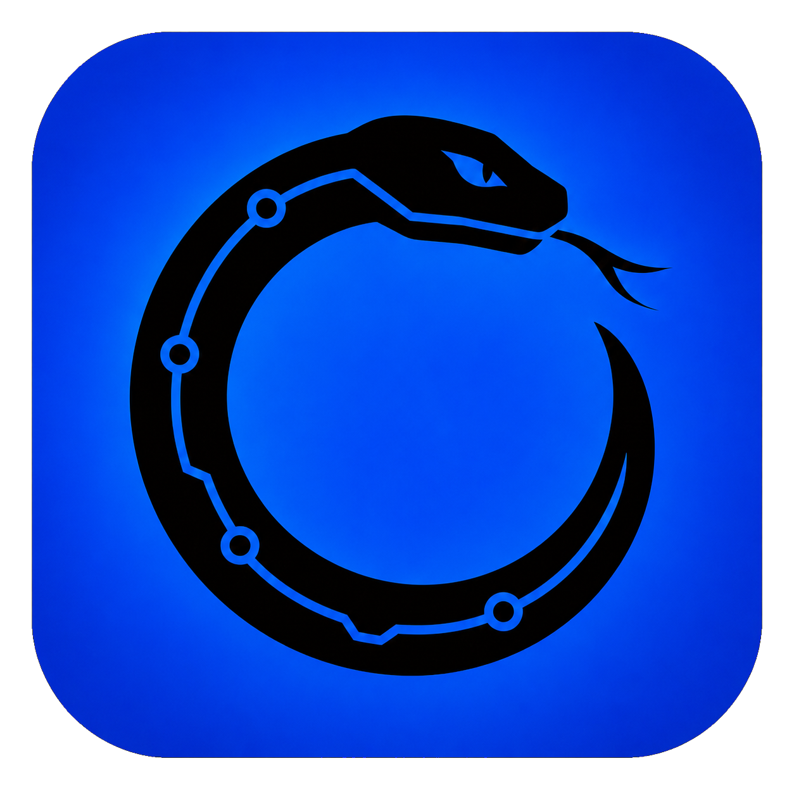

# Orion

Orion is a local-first mission control for application projects. It keeps Git facts, project intent, feature health, and the next concrete action in one desktop workspace so a builder can resume work without reconstructing context from folders, chats, and memory.



## What works in the MVP

- register a local Git repository with a native folder picker;
- scan current branch, local branches, recent commits, changed files, and upstream divergence;
- see a multi-project overview with work and risk signals;
- record each project's goal, lifecycle state, and next action;
- map features as planned, in progress, working, or blocked;
- group feature work into now, next, and later horizons;
- keep all product notes in a local SQLite database.

Orion reads repositories through the installed `git` executable. It does not upload source code, require an account, or connect to GitHub.

## Stack

Tauri 2, React 19, TypeScript, Vite, Tailwind CSS, Rust, SQLite, Vitest, ESLint, and Prettier.

## Requirements

- Windows 10 or 11;
- Node.js and npm;
- Rust with the MSVC toolchain;
- Microsoft C++ Build Tools and WebView2;
- Git available on `PATH`.

## Development

```powershell
npm install
npm.cmd run setup:local
npm.cmd run tauri dev
```

## Verification

```powershell
npm.cmd run lint
npm.cmd run format:check
npm.cmd test
npm.cmd run build
cargo test --manifest-path src-tauri\Cargo.toml
cargo check --manifest-path src-tauri\Cargo.toml
```

Run `pwsh.exe -File scripts\Build-App.ps1` for the complete Windows build. See [ai/project/WORKFLOWS.md](ai/project/WORKFLOWS.md) for artifact paths and local shortcut setup.

## Changing the app icon

Put one square transparent PNG (preferably `1024x1024 px`, minimum `256x256 px`)
in `..\new-icons\orion.png`. From `Desktop Apps`, run:

```powershell
.\tools\Apply-NewIcon.ps1 -App Orion
```

Use `-Publish` after approving the icon to rebuild the executable and refresh its desktop shortcut.

## Data and privacy

Orion stores registered repository paths, project goals, next actions, and feature notes in `orion.sqlite3` under the operating system's application-data directory. Git metadata is read locally on refresh. Removing a project from Orion never deletes its repository.

The repository intentionally excludes databases, environment files, local artifacts, exports, cookies, sessions, and private data directories. Do not commit real project databases or screenshots containing private repository information.

Publishing or cloning this source repository does not include projects registered in Orion. See [PRIVACY.md](PRIVACY.md) for the exact local-data boundary.

## Current limitations

- Windows is the only verified target.
- GitHub issues, pull requests, cloud sync, team collaboration, and autonomous code changes are outside the MVP.
- Release artifacts are currently unsigned and may trigger Windows SmartScreen.
- A public release still needs clean-machine install, upgrade, restart, offline, and uninstall verification.

## Project documentation

- [Project knowledge map](ai/README.md)
- [Product contract](ai/product/PRODUCT.md)
- [Architecture](ai/project/ARCHITECTURE.md)
- [Codebase map](ai/project/CODEBASE.md)
- [Workflow diagram](ai/project/WORKFLOW-DIAGRAM.md)
- [Build and verification](ai/project/WORKFLOWS.md)
- [Brand](ai/product/BRAND.md)
- [Privacy](PRIVACY.md)

## License

MIT. See [LICENCE.md](LICENCE.md).
