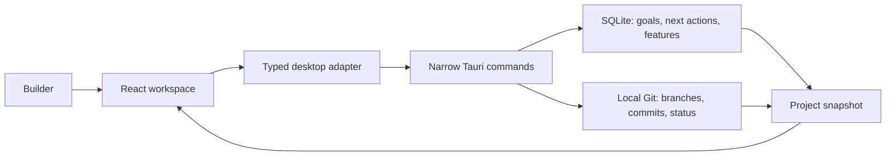
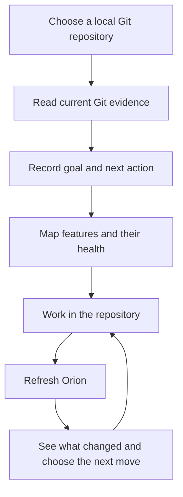

# Orion workflow

```mermaid
flowchart LR
    U["Builder"] --> UI["React workspace"]
    UI --> A["Typed desktop adapter"]
    A --> C["Narrow Tauri commands"]
    C --> DB["SQLite: goals, next actions, features"]
    C --> G["Local Git: branches, commits, status"]
    DB --> S["Project snapshot"]
    G --> S
    S --> UI
```

## Resume loop

```mermaid
flowchart TD
    A["Choose a local Git repository"] --> B["Read current Git evidence"]
    B --> C["Record goal and next action"]
    C --> D["Map features and their health"]
    D --> E["Work in the repository"]
    E --> F["Refresh Orion"]
    F --> G["See what changed and choose the next move"]
    G --> E
```

Orion never writes to a registered repository. Removing a project deletes only its Orion records.
